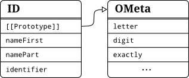
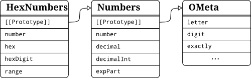
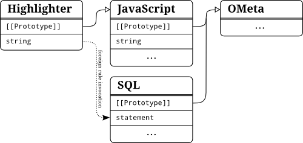

Introduction To OMeta/JS
========================
Writing parsers by hand can be quite tedious and error-prone, especially when implementing a language specification that still evolves or when experimenting with novel language features. Small changes in a grammar may result in complex changes of the parser. Thus, parser-generators are often used to automate this process. As we have seen in chapter [chap:compilation-process], a compiler commonly consists not only of a parser but also of a lexer, several translators and finally a code-generator - all of which being created with different tools or frameworks and maybe even using different languages. Alessandro Warth created OMeta to unify all of those tools in order to flatten the learning curve and to make experimenting with languages more easy [OMeta].

The goal of this chapter is to provide a solid understanding of how to work with OMeta and specially OMeta/JS. Of course Warth's thesis [OMeta] is a great source for background information and this chapter may be seen as a restructured, updated and enriched form of [OMeta, chapter 2].

OMeta is a general purpose **pattern matching language** based on parsing expression grammars (abbr. PEG). As we have seen PEGs unite the flexibility of CFGs and REs and thereby remove the separation between the process of lexical analysis and parsing. They usually operate on characters as terminals and hence can only be used to match strings.

OMeta circumvents this limitation by allowing every object of the host-language to be a terminal, thus making it possible to use OMeta in almost every step of the compilation process. It also offers many extensions to PEG like **parametrized rules**, **higher order rules** and **grammar inheritance** described in the remainder of this chapter.

Working with OMeta can be split into three single steps:

1. Write your grammar in OMeta-language
2. Set up the OMeta-compiler and compile the grammar
3. Use the resulting grammar-object to match and translate input-streams

OMeta uses **memoization** to increase performance and therefore reduces the drawbacks resulting from backtracking (Also see [FordPackrat] and chapter [sub:memoization]). In addition, it allows the use of **left-recursive rules** by modifying the memoization algorithm (See [WarthLeftRecursion] and [OMeta, chapter 3]).

OMeta/JS
--------
Being a generic language for grammar-description, OMeta has been implemented in many different **host languages**. In the remainder we will take a look atdescribe Alessandro Warth's reference implementation written in JavaScript (called OMeta/JS).

In order to get an idea of how an OMeta grammar looks like, the following listing shows a grammar with three simple rules, each separated by a comma. This simplified grammar matches JavaScript identifiers like `foobar`, `$1` and `_global`, always starting with rule `identifier`.

    ometa ID {
      identifier = nameFirst namePart*,
      nameFirst  = letter | '$' | '_',   
      namePart   = nameFirst | digit  
    }

Here the structure of every OMeta gets visible. Since OMeta/JS is a combination of the OMeta-language and JavaScript the keyword `ometa` is used to announce that a following section is written in OMeta. After the introductory keyword the **name** of the OMeta grammar is expected before it's implementation can take place inside of the following block. Compiling this grammar to JavaScript results in a JavaScript-object `ID` containing three methods to match the specified rules. Since no parent-grammar has been specified OMeta assumes that it's base grammar `OMeta` should be the parent. Hence, a prototypal link to an object representing this base grammar is added as depicted in the figure below. Here we can get a quick idea of how OMeta/JS models the inheritance of different grammars by using the prototype-chain.

<figure>
  
  <figcaption>The two grammar objects ID and OMeta</figcaption>
</figure>
  
  
Writing Grammars
----------------
The most important part of implementing a parser by the means of a parser generator is to write a grammar. To accomplish this task we will start off by taking a look at the different tools and syntax elements provided by OMeta.

### Differences to PEG #
OMeta supports almost all default operators that can be found in PEG. Nevertheless, new features have been introduced which conflict syntactically with existing operators. The following table illustrates the differences to the syntax as it is known from PEG.

<figure>
  

  
  <dl>
  <dt><code>expr_a | expr_b</code>
  <dd>Priotized <strong>Choice</strong> (try <code>expr_a</code> then <code>expr_b</code>)
  </dl>
  
  <dl>
  <dt><code>expr_a ␣ expr_b</code>
  <dd><strong>Sequence</strong> (<code>expr_a</code> followed by <code>expr_b</code>)
  </dl>
  
  <dl>
  <dt><code>(expr)</code>
  <dd><strong>Grouping</strong> to force precedence
  </dl>
  
  <dl>
  <dt><code>expr?</code>
  <dd><strong>Optional</strong> occurance of <code>expr</code>
  </dl>
  
  <dl>
  <dt><code>expr+</code>
  <dd><strong>Multiple</strong> occurance of <code>expr</code>, but at least once
  </dl>
  
  <dl>
  <dt><code>expr*</code>
  <dd><strong>Zero or many</strong> subsequent <code>expr</code>.
  </dl>
  
  <dl>
  <dt><code>&expr</code>
  <dd><strong>Positive lookahead</strong> of <code>expr</code>. Does not consume anything.
  </dl>
  
  <dl>
  <dt><code>~expr</code>
  <dd><strong>Negative lookahead</strong> of <code>expr</code>. Does not consume anything.
  </dl>
  
  <dl>
  <dt><code>anything</code>
  <dd><strong>Consumation</strong> of the next input without inspecting it
  </dl>
  
  

  <figcaption>PEG Operators in OMeta</figcaption>
</figure>

Character classes as they are known from regular expressions and adopted by PEG do not have an equivalent syntax in OMeta. In order to allow the pattern matching of lists (as it can be seen in section [sub:Pattern-Matching]), brackets had to be reserved and thus could not be used to match character classes. Regardless of the missing syntax it is still possible in OMeta/JS to implement a character range by using parametrized rules. For example the class `[a-z]` can be matched by the rule `range('a', 'z')`. The implementation of range can be found in appendix [chap:OMeta-methods].

The use of basic PEG operators within OMeta is demonstrated in the next code sample.

    ometa Numbers {
      number     = decimal,
      decimal    = '-'? decimalInt+ ('.' digit+)? expPart?
                 | '-'? ('.' digit+) expPart?,
      decimalInt = '0' | (~'0' digit) digit*,   
      expPart    = ('e' | 'E') ('+' | '-')? digit+  
    }

As already known from PEG, the lookahead operators assure whether the next input-token does (`&` positive) or does not (`~` negative) match the given expression. It is important to note that thereby **no input is consumed**. In this example it gets visible how the negative lookahead operator is used to exclude the character `'0'` which would otherwise be matched by the rule `digit`. The starting point for this grammar is the rule `number`. The grammar matches all allowed decimal numbers like `-3`, `4.7`, `.6` and `6.18e-1`.

### Pattern Matching #
In contrast to PEG which only allows to match a stream of characters, OMeta is able to match a stream of arbitrary host-language objects. There are quite a few types of objects in JavaScript for which OMeta provides a dedicated syntax as it can be seen in the following table.

<figure>
  

  <dl>
  <dt><code>'c'</code>
  <dd>Matches a string-object of the host-language. During parsing a string is decomposed into a stream of characters. Hence, most of the time this notation is used to match single characters
  </dl>

  <dl>
  <dt><code>&#96;&#96;string''</code>
  <dd>Matches a sequence of characters (Please note, that the string is delimited by two backticks on the left and two single quotes on the right hand side)
  </dl>

  <dl>
  <dt><code>1337</code>
  <dd>Matches a number-object of the host-language
  </dl>
  
  <dl>
  <dt><code>[char 'o' 'o' 1234]</code>
  <dd>The list notation allows matching a sequence of arbitrary objects inside of a list.
  </dl>
  
  

  <figcaption>Syntax for matching different types of objects</figcaption>
</figure>

Like with PEG, the most basic terminals a parser may recognize are single characters and sequences of characters. When matching a string like `"var foo = 4"` OMeta destructs this string into it's single characters in order to form a stream:

    ['v', 'a', 'r', ' ', 'f', 'o', 'o', ' ', '=', ' ', '4']

Here it gets visible why every single character has to be matched separately. If a sequence of characters like `var` is expected this has to be denoted explicitly by using the character sequence notation <code>&#96;&#96;var''</code>. In fact, this notation is semantically equivalent to `'v'` `'a'` `'r'`.

In contrast to parsers, a translator has to work on structures. For this task OMeta provides a notation that can be used to match lists. Consider the task of converting a prefix notation, as it is used by Lisp, to be infix. Given the following input

    ['+', 5, ['-', 3, 8]]

a grammar has to recursively match the contents of the lists. Like already said, this can be performed by using the list-notation like

    ometa PreToInfix {
      list     = [operator:op content:first content:second] -> [first, op, second],
      content  = list | number,
      operator = '+' | '-' | '*' | '/'
    }

Please note that in contrast to JavaScript arrays, the elements inside of the list-notation are separated by **whitespaces** and **not commas**. To transform the output of rule `list`, semantic actions are used which will be presented in subsequent sections.

Generally speaking, every JavaScript object may be matched by utilizing predicates. For example the rule

    expressions = anything:n ?(n.name == expr)

can be used to match objects like `{ name: "expr", contents: [] }`. Until now, there is no special pattern matching syntax for generic objects.

### Semantic Predicates #
Since OMeta/JS is an aggregation of OMeta and JavaScript, we can use JavaScript inside of `semantic predicates` to refine the matching process. The host-language expression inside of a semantic predicate should evaluate to a boolean value. If the resulting value is `falsy`, the matching of the current rule is assumed to be failed and therefore aborted, whereas a truthy value leads to a continuation of the matching-process. The following grammar uses predicates to differ between even and odd digits in order to match numbers like `381496`. It gets visible that the prefix-operator `?` is followed by a JavaScript expression which may, but don't necessarily has to be wrapped in parenthesis.

    function even(digit) {
      return parseInt(digit) % 2 === 0;
    }
    ometa EvenOdd {
      even   = digit:d ?even(d),
      odd    = digit:d ?( !even(d) ),
      number = <(even odd)+ even?
               | even
               >:n -> parseInt(n)
    }

Of course the function even could have also been inlined in the semantic predicates like:

    even = digit:d ?(parseInt(d) % 2 === 0)

In OMeta, the result of the last expression within a rule always is used as result of the rule. Since the semantic predicate returns a boolean value, the result of the rules `even` and `odd` is this boolean value and not the digit itself. To bypass this problem the capture operator `<...>` is used that records all input which is matched by the enclosed rules. Another solution to this problem would have been to add a semantic action at the end of each rule:

    even = digit:d ?even(d)      -> d,
    odd  = digit:d ?( !even(d) ) -> d,

Semantic predicates also can be used to include context information in matching decisions. For example it might be checked whether a variable, to which a value is about to be bound, has been declared before hand.

### Semantic Actions #
Usually, it is the job of a grammar to decide whether or not an input can be matched using the given rules. Although this is a useful information, we often need to work with the recognized input in order to extract information or to modify it. For example a stream of strings may be transformed into an intermediate representation like an abstract syntax tree. The other way around, an existing AST can be used as input to a translator to be converted to code again. For this purpose the output of each rule may be transformed using so called **semantic actions**.

There are three different ways to express semantic actions in OMeta. The first one, which is mostly used to transform the output of a rule, is denoted by the arrow-operator `->`. It may appear after each expression and is delimited by either a comma (end of rule), pipe-character (end of choice) or closing curly brace (end of grammar). Hence, it's precedence is higher than a choice, but lower than a sequence. If a programmer wants to define a semantic action to manipulate the output of a choice-expression as a whole and not for a individual option, the choice has to be wrapped in parenthesis. The implementation of a semantic action can be any **expression** of the host language.

Again, if no semantic action is given for a rule, the result of the last applied expression is used without any transformation.

    ometa Numbers {
      number     = decimal,
      decimal    = <'-'? decimalInt+ ('.' digit+)? expPart?>:n -> parseFloat(n)
                 | <'-'? ('.' digit+) expPart?>:n              -> parseFloat(n),
      decimalInt = '0' | (~'0' digit) digit*,   
      expPart    = ('e' | 'E') ('+' | '-')? digit+
    }

The above grammar is a enhancement of the grammar previously seen. Semantic actions are used in rule decimal on the right-hand side of every choice to call the JavaScript function `parseFloat(n)`. But where does the identifier `n` come from and to which value is it bound? The **capture operator**, denoted by `< ... >` captures the input used to match the inner expressions. It is very useful if we want to work with the consumed input independently of any transformations performed in the descendant rules. Using the property assignment operator `lhsExpr:id` the result of evaluating the left-hand side expression is bound to the identifier, which can be accessed in every associated host-language code like semantic actions, predicates and calls to parametrized rules.

When trying to find out in which scope an identifier can be used, we have to recall that every rule is compiled to it's own JavaScript function. Thus, every variable defined by the assignment operator can be accessed only within the corresponding rule. 

<figure>
  

  <dl>
  <dt><code>expr -> host_expr</code>
  <dd><strong>Semantic action</strong> which transforms the result of <code>expr</code>, using an expression in the host language. (i.e. JavaScript)
  </dl>
  
  <dl>
  <dt><code>{host_expr}</code>
  <dd><strong>Semantic action</strong>, equivalent to the above except that the host expression is enclosed by curly braces.
  </dl>
  
  <dl>
  <dt><code>!host_expr</code>
  <dd><strong>Semantic action</strong>, again equivalent to arrow notation
  </dl>
  
  <dl>
  <dt><code>?host_expr</code>
  <dd><strong>Semantic predicate</strong> - if <code>host_expr</code> evaluates to <code>true</code>, than the rule matches sucessfully.
  </dl>
  
  <dl>
  <dt><code>rule( host_expr )</code>
  <dd><strong>Parametrized rule</strong> - the result of <code>host_expr</code> is prepended to the inputstream before <code>rule</code> is applied.
  </dl>
  
  <dl>
  <dt><code>expr:id</code>
  <dd><strong>Assignment operator</strong> - binds the result of <code>expr</code> to the variable <code>id</code> which can be used in host-language context
  </dl>
  
  <dl>
  <dt><code>&lt; expr &gt;</code>
  <dd><strong>Capture operator</strong> - works like the grouping-operator, but captures all consumed input used to match <code>expr</code> and returns it.
  </dl>
  
  <dl>
  <dt><code>@&lt;rule&gt;</code>
  <dd><strong>Index capture operator</strong> - returns an object that contains the indices framing the consumed input (e.g. { fromIdx: 3, toIdx: 7 })
  </dl>
  
  <dl>
  <dt><code>Foreign.rule</code>
  <dd><strong>Foreign rule invokation</strong> - calls rule <code>rule</code>, residing in the foreign grammar <code>Foreign</code>
  </dl>
  
  

  <figcaption>Summary of OMeta syntax, as additional to PEG operators</figcaption>
</figure>

The above table gives an overview over the different syntactical extensions OMeta offers. The first three entries of the table all represent semantic actions. They only differ in their syntax. Semantic actions are executed during the matching process according to their position within a rule. The side-effects created by semantic actions are not automatically undone by OMeta if a rule does not match in the end. The behavior of creating side-effects is visually emphasized by the exclamation prefix notation.

### Parametrized Rules #
OMeta adds even more flexibility to the grammar by allowing the use of arguments on rules, so called **parametrized rules**. Those rules behave basically the same as the one without arguments. The passed arguments are simply prepended to the input stream, before the rule is matched. Consequently, parametrized rules also support pattern matching on their parameters. Thus, the notation `rule :a :b` is only shorthand for `rule anything:a anything:b`.

Let's examine an extension to the above grammar EvenOdd. Instead of defining multiple rules, one for each digit-type, there is only one parametrized rule.

    ometa EvenOdd {
      even   :yes = digit:d ?(yes === even(digit)),
      number      = <(even(true) even(false))+ even(true)?
                    | even(true)
                    >:n -> parseInt(n)
    }

It is important to point out that the call-arguments of parametrized rules can be any valid expressions of the host language. The result of the expression is than bound to the parameter of the invoked parametrized rule. In the first call to `even` the JavaScript value `true` is bound to the parameter `yes` and therefore further can be used in all locations where host-language is allowed.

Another example for parametrized rules is the built-in function `token(tok)`. As previously stated, OMeta can be used as "one shoe fit's it all" solution for the diverse compilation stages. The `token` rule helps to combine "scannerful" and "scannerless" parsing. The stage of lexical analysis, usually performed by a **lexer**, can be included in the parser-grammar:

    ometa Lisp {
      // Lexer
      identifier = <letter+>:id      -> { type: "Id", value: id },
      number     = <digit+>:num      -> { type: "Number", value: parseInt(num) },  
      punctuator = '(' | ')' |'.' | ',',

      token :tt  = spaces ( punctuator:t             ?(t == tt)      -> t
                          | (identifier | number):t  ?(t.type == tt) -> t
                          ),

      // Parser
      list       = token("(") (atom | list)+:cs token(")") -> { type: "List", content: cs },
      atom       = token("Id") | token("Number")  
    }

Starting with rule list the grammar can be used to parse simple Lisp-like lists. The given input `"(plus 4 (minus 8 6)"` results in the tree consisting of objects:

    { type: "List", content: [
      { type: "Id", value: "plus" },
      { type: "Number", value: 4 },
      { type: "List", content: [
        { type: "Id", value: "minus" },
        { type: "Number", value: 8 },
        { type: "Number", value: 6 }]
      }]
    }

Every object has one property `type` to specify it's kind. Additionally identifier and numbers save their values in the property `value`. Lists in turn store the contained list items in the property `content`.

As it gets clearly visible the lexer is included directly in the parser grammar. Every time a token needs to be scanned the method `token` is invoked, providing the required type of token as a string. OMeta provides a special syntax for this kind of invocation since it is used pretty often. Instead of writing `token("Id")` the programmer might simply use a shorthand syntax `"Id"`. At first glance this might easily be mixed up with the matching of strings. Hence, it is important to keep in mind that strings are broken down to character sequences and therefore the syntax <code>&#96;&#96;string''</code> or `seq("string")` has to be used.

Using the shorthand notation for token the parser rules may be rewritten as

    list       = "(" (atom | list)+:cs ")" -> { type: "List", content: cs },
    atom       = "Id" | "Number"

which is much more convenient to read and write.

### Higher-Order Rules #
Among the methods of the OMeta base grammar the `rule apply(rule_name)` can be found, which expects `rule_name` to be a string and invokes the rule in place. Therefore, a call to `apply("myrule")` is identical to `myrule`. Equipped with `apply` and parametrized rules it is possible to create **higher order rules** by passing rule-names as arguments. The higher order rule itself can in turn make use of `apply`. In OMeta some built-in functions are implemented that way. In appendix [chap:OMeta-methods] a pseudo implementation of the base grammar with all of it's built-in rules can be found. For example let's analyze `listOf(rule, sep)` that can be used to match a list of items. The internal implementation is close to:

    listOf :rule :sep = apply(rule):f (token(sep) apply(rule)):r*  -> [f].concat(r)
                      | empty                                      -> []

Each item has to match rule and is delimited by the provided separator. Here we can see how the given rule is applied at all positions where a matching item is expected. Considering the above number-grammar, a call to `listOf(#decimal, ',')` could match an input string like `"1.5, 4, -8"`. The usage of the dubious literal `#decimal` as first argument will be explained in the following section.

### It's all about Context: OMeta or JavaScript? #
To write comprehensive grammars in OMeta it is necessary to distinguish between the two languages we are working with. Firstly the OMeta language and secondly the underlying host-language: JavaScript. Outside of a grammar definition only host-language code is valid. For example we are not able to write OMeta rules outside of a grammar.

    // here only JavaScript can be written
    ometa Grammar {
      // only OMeta is allowed right here
      rule   :a :b = { ... } otherRule !( ... )  -> ...,  // semantic action
      otherRule    = rule:c ?( ... ),                     // semantic predicate
      start        = rule(..., ...) "rule" apply(...)     // parametrized rule
    }
    // again: just JavaScript is allowed

The other way around, OMeta is our primary language inside of a grammar definition as it is illustrated the above piece of code. Here we can see that host-language code is valid outside of a grammar ( `... ometa Grammar {} ...` ), inside of semantic predicates ( `?(...)` ), inside of semantic actions ( `{...}`, `!(...)` and `-> ...` ) and inside the call of parametrized rules ( `rule(...)` ). At every occurrence of an ellipsis we might implement a JavaScript expression. As an exception to that rule, in the first case also all JavaScript statements are also allowed.

However, there are some ambiguous notations regarding strings. For example, as we have seen, the notation `"attention"` in OMeta-language context is **not a string**. It is equivalent to calling the parametrized function `token` and passing the JavaScript string value `attention` as first argument. In contrast, appearing in host-language context `"attention"` represents a string. In order to prevent this confusing usage of double quoted string, the word literal (e.g. `#singleWord`) has been introduced to host-language context. The following table provides an overview of string literals and their semantics depending on the context of use.

<figure>
  <table>
  <tr>
  <th>
  <th><code>#</code>
  <th><code>" "</code>
  <th><code>' '</code>
  <th><code>&#96;&#96; ''</code>
  </tr>
  
  <tr>
  <th>OMeta
  <td>single word string
  <td><code>token(...)</code>
  <td>string-object
  <td>char-sequence
  </tr>
  
  <tr>
  <th>JavaScript
  <td>single word string
  <td>string
  <td>string
  <td>-
  </tr>

  </table>
  <figcaption>Semantics of string-literals depending on the context</figcaption>
</figure>

    [tab:Semantics-of-string-literals]

All host-language sections inside of a grammar are compiled into individual functions which are called in the context of the grammar-object. Due to this fact, the binding of `this` in these sections is always the grammar-object itself.

### Grammar Inheritance #
One of the most important features in OMeta is the reuse and composition of grammars. Grammars can make use of other grammars in two ways. Firstly, a grammar can inherit from another. This is expressed by using the inheritance operator `<:` followed by the grammar to inherit from. If no parent is given, the grammar implicitly inherits from the OMeta base grammar which is stored in the grammar-object `OMeta`. Thus writing `grammar Numbers {}` and `grammar Numbers <: OMeta {}` is equivalent. Of course the parent grammar needs to be compiled first before it can be extended.

For example let's extend the number grammar to additionally allow hexadecimal numbers to be matched. This may be achieved by writing a grammar similar to the following one:

    ometa HexNumbers <: Numbers {
      range :from :to = char:x ?(from <= x && x <= to)             -> x,
      hexDigit        = digit | range('a', 'f') | range('A', 'F'),    
      hex             = ``0x'' <hexDigit+>:ds                      -> parseInt(ds, 16),
      number          = hex | ^number
    }

The function `range` is introduced to check for character ranges. The implementation is identical to the one in appendix [chap:OMeta-methods]. It is realized as a parametrized rule expecting two parameters - the lower as well as the upper boundary. Rule `hex` indirectly uses this function to match an arbitrary number of hex digits and returns the decimal value Tthe second argument of the JavaScript function call `parseInt(ds, 16)` is the radix parameter, specifying that the hexadecimal system should be used for parsing). The last rule `number` matches either the rule `hex` or `^number`. The latter is a **super-call** to the parent-grammar applying rule `number`. In general, if a rule isn't defined in the grammar, the lookup automatically continues recursively with the parent-grammar. Given the situation that a rule with the exact same name is defined in the child grammar, just like `number`, this rule is preferred and shadows the implementation of it's parent. This behavior is similar to the one found in classical object orientation. Nevertheless, it is still possible to access the parent-rule by using the super-call operator. The following figure illustrates how OMeta/JS uses the prototypal chain to realize the inheritance of the different grammars.

Another example for using this inheritance-mechanism is to create debugging rules:

    log :rule = ^pos:p <apply(rule)>:t !console.log("pos "+p+":", t) -> t,
    next      = ^pos:p &anything:t     !console.log("pos "+p+":", t)

The first rule `log` is a higher order rule expecting the rule name to apply. It can be used to log the position and input consumed by a special rule. The second rule `next` is a little easier to understand. A positive lookahead is used to log the position and the upcoming element of the input-stream without consuming it.

Since at the end of the inheritance-chain every grammar implicitly extends OMeta, it is important to know which rules are provided by this special grammar-object. For this purpose a pseudo implementation of all rules the base object offers can be found in appendix [chap:OMeta-methods].

### Foreign Rule Invocation #
Building on top of existing grammars, the mechanism of inheritance is a big advance to the classical way of combining two grammars: Copying both grammars into one file and hope there are no name-clashes. But single inheritance fails when we want to include two or more grammars into a new one. This is when it comes to **foreign rules**.

Given the example we want to implement a syntax highlighter that automatically detects SQL strings within another language (for instance JavaScript). Equipped with the two grammars JavaScript and SQL this task can be accomplished pretty easy:

    ometa Highlighter <: JavaScript {
      string = '"' SQL.statement:c '"' -> { type: "SQLString", content: c }
             | ^string
    }

In this example we are extending the rule `string` to also match SQL strings. If the contents of the string cannot be recognized by the foreign rule `SQL.statement`, the rule falls back to the parent implementation of grammar `JavaScript`. This example illustrates how rules of other grammar objects can just be applied as if they where part of the current grammar. Nevertheless, in contrast to grammar inheritance, applying foreign rules results in a change of contexts. The input stream is just borrowed by the foreign rule and handed back when the matching has been finished. Returning the flow of control is performed anyway, independent of success or error.

This procedure can be compared to switch the track for matching and continue on this track as far as we can. After the matching on that track is finished we change the lane again and return to the original grammar. Of course, just like every own rule, the track can always be a dead end.

The following figure illustrates the dependencies of the different grammars involved in the previous example.

Again, it is an important requirement that all grammar objects have to be loaded in the same environment before they may be used for inheritance or foreign rule invocation.

Using OMeta/JS
--------------
In the previous section we have learned how to write sophisticated OMeta/JS grammars. In order to be able to use the grammars in combination with the reference implementation we have to do some preparations. The first step is to load all files required to compile the grammars. A list of those files, together with a short description, can be found in appendix [sec:ometa-js-files].

Due to the large amount of files it appears reasonable to concatenate them to one file, which we may call `ometajs.js` in the remainder of this section. After all, in order to use OMeta/JS the most important three objects implemented in those files are:

<dl>
  <dt>OMeta</dt>
  <dd>The base grammar object every grammar inherits from.</dd>
  
  <dt>BSOMetaJSParser</dt>
  <dd>This grammar object can be used to parse OMeta/JS grammars, starting with the rule topLevel.<dd>
  
  <dt>BSOMetaJSTranslator</dt>
  <dd>This grammar object can be used to compile the tree, produced by `BSOMetaJSParser`, to JavaScript code. The starting rule for this grammar is `trans`.</dd>
</dl>

Since OMeta/JS is implemented in JavaScript we may use it inside of a browser environment. In the following, we will set up OMeta in a few steps. For this purpose, we create a html file called `ometa.html` with the following contents:

    <!DOCTYPE html>
    <html>
      <head>
        <title>OMeta/JS</title>
        
        
        
      </head>
      <body></body>
    </html>

The necessary files to compile and execute OMeta/JS grammars are included in the first script-tag. Inside of the second script-tag with attribute `language` set to `OMetaJS` (Which by the way only is for illustrative purpose) we may now add any OMeta/JS grammar like the `Numbers` grammar, as seen above. The setup of the compilation process, as described in the following, takes place within the third script-tag. First of all we need to retrieve the textual `source` of our grammar definition. This can be easily achieved by requesting the script-tag and reading property `innerHTML`.

    var source = document.getElementById("grammar").innerHTML;

The next step is to parse the source, using `BSOmetaJSParser` which is already loaded into the global namespace by including `ometajs.js`. Like every OMeta object the parser provides the two methods `match` and `matchAll`. At this point only the latter one is of significance.

    matchAll(input, rule, args?, failure?)

The function requires at least two arguments. The first argument, representing the input which is about to be matched by the grammar, has to be a streamable object. This only applies to strings and arrays by default. The second argument `rule` specifies the starting point of the matching process. The remaining arguments are optional. If the starting rule is a parametrized rule, the required arguments can be prepended to the input stream by providing an array as third argument `args`. Finally an optional callback function `failure` can be registered to handle errors.

    var tree = BSOMetaJSParser.matchAll(source, 'topLevel');

The result of the matching process is an OMeta/JS language parse-tree, representing our grammar definition. In order to receive valid JavaScript code we need to translate this tree using the `BSOMetaJSTranslator` object and the method `match`. The required arguments of `match` are exactly the same like the ones of `matchAll`, with the exception that any JavaScript object may be provided as `input` (For instance the OMeta grammar `ometa Four { n = 4 }` will successfully match the number four by applying `Four.match(4, 'n')`). In this case we are matching the syntax tree resulting from the previous step.

    var grammar = BSOMetaJSTranslator.match(tree, 'trans');

After applying the above line, the variable grammar contains a textual representation of JavaScript code. To bring it to life and in order to actually use our grammar object we have to evaluate the JavaScript-string.

    eval(grammar);

This introduces a new variable in the global scope named identical to the compiled grammar. In this case the variable `Numbers` will contain the desired grammar object.

### Stateful Pattern Matching #
By adding semantic actions OMeta allows not only to manipulate the results of expressions (for instance in order to create the syntax tree), but also to trigger side effects during the process of matching. This can be really useful, for instance if we want to gather information such as the occurrence of strings in order to collect them in a string table. An example of how this task can be achieved is illustrated in the next code sample:

    ometa SomeParser {
      ...
      string = '"' <(~'"' char)+>:cs '"' !this.collect(cs):i -> { type: "String", id: i }
      ...
    }
    Parser.initialize = function() { this.strings = []; }
    Parser.collect = function(string) {
      var i = this.strings.indexOf(string);
      if(i === -1)
        return this.strings.push(string) - 1;
      else
        return i;
    }

In this example `SomeParser` makes use of semantic actions like `!this.collect` to push all found strings in a shared string table. Each string is only stored once - duplicates are filtered. Each string is finally replaced with an AST node containing the id (the position of the string inside of the collection), not the value itself. The callback function `initialize` is registered in order to prepare the parser instance before the matching can start.

Summary
-------
OMeta/JS rendered itself to be an elegant solution for the different steps of compilation. It allows to match not only streams of characters, but also arbitrary host objects. To provide this functionality, the OMeta language shows some differences compared to common parsing expression grammars. Additionally, it equips the developer with features like left-recursion, semantic predicates, semantic actions, grammar inheritance and foreign rule invocation. We have seen how parametrized rules can be combined with the rule `apply` to create higher order rules. Nevertheless, there are some pitfalls like the difference between host-language and OMeta context. Moreover, the subtle distinction between the various string-literals is not quite easy and requires some attention.

Due to the fact that setting up OMeta requires the inclusion of many files, we have concatenated them all into one single file. This allows to work with OMeta grammars more easily.
